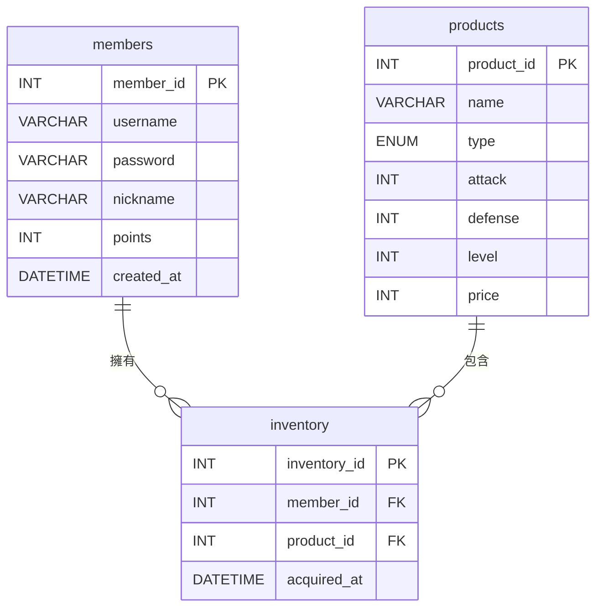

---

## mode: edit

# 🎯 目的

建立一個前後端小專題：**文字修仙互動式網頁（小說型遊戲）**。

## 🌐 前端網頁

* 檔案名稱：`login.html`, `register.html`, `shop.html`, `inventory.html`, `story.html`
* 全站統一古風精美樣式（SVG雲霧、漸層背景、花紋、字型、RWD），所有頁面皆採用一致設計。
* 主要區塊、標題、按鈕、表格皆加大字體與間距，畫面寬敞舒適。
* 商城頁面提供商品分類（武器、防具、祕笈、全部），玩家可依分類瀏覽商品。
* 故事頁面資訊（點數、壽命）與操作按鈕排版整齊，選項按鈕自動換行，並有右下角「修仙小提示」浮動區塊。

## 📋 功能需求

### `login.html`
* 古風樣式登入表單，帳號/密碼欄位。
* 使用 fetch API POST 登入，回傳 JSON，顯示成功/失敗提示。

### `register.html`
* 古風樣式註冊表單，帳號/密碼/暱稱欄位。
* 註冊成功自動跳轉登入。

### `shop.html`
* 顯示商城商品（裝備、武器、武功祕笈、靈丹妙藥等）。
* 商品依分類顯示，分類按鈕可切換。
* 顯示會員現有商城點數（即時同步）。
* 購買按鈕，購買成功自動刷新點數並跳轉冒險。

### `inventory.html`
* 顯示會員擁有的裝備與武功，攻擊/防禦/等級/獲得時間。

### `story.html`
* 顯示修仙劇情文字內容，依會員選擇不同路徑發展故事。
* 事件可獲得/失去商城點數、獲得裝備、死亡結局、飛昇結局。
* 點數獲得/失去時，能即時更新點數顯示，並與商城頁同步。
* **壽命機制**：每次事件觸發壽命減少，壽命歸零即死亡結局，壽命顯示於頁面。
* **靈丹妙藥**：事件或商城可獲得靈丹妙藥，使用可增加壽命。
* **特殊事件**：隨機事件有機會獲得特殊道具（如結局券、靈丹妙藥、不死藥等）。
* **裝備影響死亡率**：玩家裝備越強，死亡機率越低（依攻擊、防禦、等級加成計算）。
* 右下角浮動「修仙小提示」區塊，隨機顯示修仙語錄。

## 🎨 CSS框架

* 使用 Bootstrap 5.3.1（CDN 載入）
* 客製樣式檔：`style.css`，全站統一古風設計，RWD 支援，主要區塊加大字體與間距。

---

# 🖥️ 後端網頁

* 檔案名稱：`login.php`, `register.php`, `shop.php`, `inventory.php`, `add_points.php`

## 🔥 功能需求

### `login.php`
* 驗證帳號與密碼，回傳 JSON。

### `register.php`
* 新增會員資料，回傳 JSON。

### `shop.php`
* 提供商品列表、購買功能，檢查點數、扣除點數、加入背包。
* 商城商品包含裝備、武功、祕笈、靈丹妙藥、特殊道具。

### `inventory.php`
* 顯示會員現有裝備與武功。

### `add_points.php`
* 供故事事件呼叫，安全增減會員商城點數，回傳最新點數，確保前後端點數同步。

---

# 📊 資料表設計 (ERD)

* members, products, inventory 三表，PK/FK 關聯，詳見下方 ER 圖。
* 商品範例：七星劍、紫霞仙袍、九陽真經、靈丹妙藥、仙鶴靈丹、長生丹、不死藥等。

---

# ✅ 額外規範

* MySQL 資料庫
* 全站 RWD
* JSON 統一格式回傳
* 登入後設置 Session 儲存 member_id
* 商品可內建範例：七星劍、紫霞仙袍、九陽真經、靈丹妙藥、結局券等
* 全站統一古風精美樣式，SVG雲霧、漸層背景、花紋、字型
* 故事事件可即時同步商城點數
* **壽命機制**：每次事件觸發減少壽命，壽命歸零即死亡結局，靈丹妙藥可增加壽命
* **裝備影響死亡率**：攻擊、防禦、等級越高，死亡率越低
* **特殊事件/道具**：隨機事件可獲得特殊道具（如靈丹妙藥、結局券、不死藥等）
* **UI細節**：主要資訊與操作按鈕排版整齊，選項自動換行，浮動提示區塊美化

### `register.php`

* 新增會員資料至 `members` 資料表
* 回傳 JSON 結果：成功或錯誤訊息

### `shop.php`

* 提供商城商品列表（來自 `products` 資料表）
* 購買功能：檢查點數是否足夠，若足夠扣除點數並新增至會員背包

### `inventory.php`

* 顯示會員現有裝備與武功

---

# 📊 資料表設計 (ERD)

## 1️⃣ members (會員資料)

| 欄位名稱        | 資料型別         | PK | FK | 說明     |
| ----------- | ------------ | -- | -- | ------ |
| member\_id  | INT          | PK |    | 會員編號   |
| username    | VARCHAR(50)  |    |    | 登入帳號   |
| password    | VARCHAR(255) |    |    | 密碼（明碼） |
| nickname    | VARCHAR(50)  |    |    | 遊戲暱稱   |
| points      | INT          |    |    | 商城點數   |
| created\_at | DATETIME     |    |    | 註冊時間   |

## 2️⃣ products (商城商品)

| 欄位名稱        | 資料型別                 | PK | FK | 說明     |
| ----------- | -------------------- | -- | -- | ------ |
| product\_id | INT                  | PK |    | 商品編號   |
| name        | VARCHAR(100)         |    |    | 商品名稱   |
| type        | ENUM('武器','防具','祕笈') |    |    | 商品類型   |
| attack      | INT                  |    |    | 攻擊值    |
| defense     | INT                  |    |    | 防禦值    |
| level       | INT                  |    |    | 裝備等級   |
| price       | INT                  |    |    | 價格（點數） |

## 3️⃣ inventory (會員背包)

| 欄位名稱          | 資料型別     | PK | FK | 說明     |
| ------------- | -------- | -- | -- | ------ |
| inventory\_id | INT      | PK |    | 背包紀錄編號 |
| member\_id    | INT      |    | FK | 關聯會員編號 |
| product\_id   | INT      |    | FK | 關聯商品編號 |
| acquired\_at  | DATETIME |    |    | 獲得時間   |

## 🔗 ER 圖說明

* **members.member\_id** → **inventory.member\_id**（一對多）
* **products.product\_id** → **inventory.product\_id**（一對多）

---

# ✅ 額外規範

* 採用 MySQL 作為資料庫
* 前端支援 RWD
* JSON 統一格式回傳
* 登入後設置 Session 儲存 member\_id
* 商品可內建範例：

  * 「七星劍」攻擊+20、防禦+5、等級1、價格500
  * 「紫霞仙袍」攻擊+0、防禦+30、等級2、價格800
  * 「九陽真經」攻擊+50、防禦+10、等級3、價格1500
  * 「靈丹妙藥」使用後可增加50點壽命
  * 「結局券」使用後可隨機獲得一個結局
  * 「不死藥」使用後可復活一次，並回復全盛期
