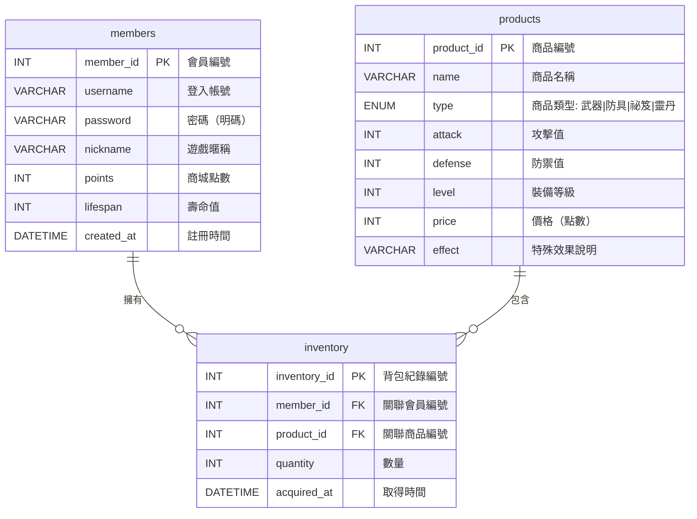

---

## mode: edit

# 🎯 目的

建立一個前後端小專題：**文字修仙互動式網頁（小說型遊戲）**。

## 🌐 前端網頁

* 檔案名稱：`login.html`, `register.html`, `shop.html`, `inventory.html`, `story.html`
* 全站統一古風精美樣式（SVG雲霧、漸層背景、花紋、字型、RWD），所有頁面皆採用一致設計。
* 主要區塊、標題、按鈕、表格皆加大字體與間距，畫面寬敞舒適。
* 商城頁面提供商品分類（武器、防具、祕笈、靈丹、全部），玩家可依分類瀏覽商品。
* 故事頁面資訊（點數、壽命）與操作按鈕排版整齊，選項按鈕自動換行，並有右下角「修仙小提示」浮動區塊。
* 導航列統一設計，包含商城、背包、冒險、登出等功能按鈕。

## 📋 功能需求

### `login.html`
* 古風樣式登入表單，帳號/密碼欄位。
* 使用 fetch API POST 登入，回傳 JSON，顯示成功/失敗提示。
* 登入成功後自動跳轉至商城頁面。

### `register.html`
* 古風樣式註冊表單，帳號/密碼/暱稱欄位。
* 表單驗證（密碼長度、帳號格式等）。
* 註冊成功自動跳轉登入頁面。

### `shop.html`
* 顯示商城商品（裝備、武器、武功祕笈、靈丹妙藥等）。
* 商品依分類顯示，分類按鈕可切換（武器、防具、祕笈、靈丹、全部）。
* 顯示會員現有商城點數（即時同步）。
* 購買按鈕，購買成功自動刷新點數並顯示購買成功訊息。
* 商品卡片顯示名稱、類型、攻擊/防禦值、等級、價格等詳細資訊。

### `inventory.html`
* 顯示會員擁有的裝備與武功，攻擊/防禦/等級/獲得時間。
* 裝備分類顯示，支援裝備數量統計。
* 靈丹妙藥使用功能，可增加壽命值。
* 特殊道具（結局券、不死藥等）使用功能。

### `story.html`
* 顯示修仙劇情文字內容，依會員選擇不同路徑發展故事。
* 事件可獲得/失去商城點數、獲得裝備、死亡結局、飛昇結局。
* 點數獲得/失去時，能即時更新點數顯示，並與商城頁同步。
* **壽命機制**：每次事件觸發壽命減少，壽命歸零即死亡結局，壽命顯示於頁面。
* **靈丹妙藥**：事件或商城可獲得靈丹妙藥，使用可增加壽命。
* **特殊事件**：隨機事件有機會獲得特殊道具（如結局券、靈丹妙藥、不死藥等）。
* **裝備影響死亡率**：玩家裝備越強，死亡機率越低（依攻擊、防禦、等級加成計算）。
* 右下角浮動「修仙小提示」區塊，隨機顯示修仙語錄。
* 多重結局系統：飛昇結局、死亡結局、特殊結局等。

## 🎨 CSS框架

* 使用 Bootstrap 5.3.1（CDN 載入）
* 客製樣式檔：`style.css`，全站統一古風設計，RWD 支援，主要區塊加大字體與間距。
* 古風配色方案：金色、深褐色、墨綠色漸層背景。
* SVG雲霧動畫效果、花紋邊框裝飾。

---

# 🖥️ 後端網頁

* 檔案名稱：`login.php`, `register.php`, `shop.php`, `inventory.php`, `story.php`, `add_points.php`, `use_item.php`
* 資料庫配置：`config.php`
* 會話管理：所有後端檔案皆包含 session 驗證

## 🔥 功能需求

### `login.php`
* 驗證帳號與密碼，回傳 JSON。
* 登入成功建立 session，記錄 member_id。
* 密碼安全驗證。

### `register.php`
* 新增會員資料，回傳 JSON。
* 檢查帳號是否重複。
* 初始化會員點數（1000點）和壽命（100點）。

### `shop.php`
* 提供商品列表、購買功能，檢查點數、扣除點數、加入背包。
* 商城商品包含裝備、武功、祕笈、靈丹妙藥、特殊道具。
* 支援商品分類篩選。

### `inventory.php`
* 顯示會員現有裝備與武功。
* 計算裝備總攻擊力、防禦力用於死亡率計算。

### `story.php`
* 處理故事事件邏輯，隨機生成事件。
* 壽命扣除、點數變動、裝備獲得等功能。
* 死亡率計算（基於裝備強度）。
* 特殊事件觸發機制。

### `add_points.php`
* 供故事事件呼叫，安全增減會員商城點數，回傳最新點數，確保前後端點數同步。

### `use_item.php`
* 處理道具使用邏輯（靈丹妙藥增加壽命、結局券等）。
* 道具使用後從背包移除。

---

# 📊 資料表設計 (ERD)

## 1️⃣ members (會員資料)

| 欄位名稱        | 資料型別         | PK | FK | 說明      |
| ----------- | ------------ | -- | -- | ------- |
| member\_id  | INT          | PK |    | 會員編號    |
| username    | VARCHAR(50)  |    |    | 登入帳號    |
| password    | VARCHAR(255) |    |    | 密碼（明碼）  |
| nickname    | VARCHAR(50)  |    |    | 遊戲暱稱    |
| points      | INT          |    |    | 商城點數    |
| lifespan    | INT          |    |    | 壽命值     |
| created\_at | DATETIME     |    |    | 註冊時間    |

## 2️⃣ products (商城商品)

| 欄位名稱        | 資料型別                        | PK | FK | 說明      |
| ----------- | --------------------------- | -- | -- | ------- |
| product\_id | INT                         | PK |    | 商品編號    |
| name        | VARCHAR(100)                |    |    | 商品名稱    |
| type        | ENUM('武器','防具','祕笈','靈丹') |    |    | 商品類型    |
| attack      | INT                         |    |    | 攻擊值     |
| defense     | INT                         |    |    | 防禦值     |
| level       | INT                         |    |    | 裝備等級    |
| price       | INT                         |    |    | 價格（點數）  |
| effect      | VARCHAR(255)                |    |    | 特殊效果說明  |

## 3️⃣ inventory (會員背包)

| 欄位名稱          | 資料型別     | PK | FK | 說明     |
| ------------- | -------- | -- | -- | ------ |
| inventory\_id | INT      | PK |    | 背包紀錄編號 |
| member\_id    | INT      |    | FK | 關聯會員編號 |
| product\_id   | INT      |    | FK | 關聯商品編號 |
| quantity      | INT      |    |    | 數量     |
| acquired\_at  | DATETIME |    |    | 獲得時間   |

## 🔗 ER 圖說明

* **members.member\_id** → **inventory.member\_id**（一對多）
* **products.product\_id** → **inventory.product\_id**（一對多）

---

# ✅ 額外規範與實作細節

## 🔐 安全性規範
* 採用 MySQL 作為資料庫
* Session 驗證機制，未登入自動跳轉登入頁
* SQL 防注入處理（prepared statements）
* 密碼安全性驗證

## 🎮 遊戲機制
* **壽命系統**：初始100點，每次事件-10~30點
* **點數系統**：初始1000點，可購買裝備或透過事件獲得
* **裝備系統**：影響死亡率，裝備越強存活率越高
* **道具系統**：靈丹妙藥（+50壽命）、結局券、不死藥等

## 📱 前端技術
* 前端支援 RWD，適配手機、平板、桌機
* JSON 統一格式回傳
* fetch API 處理 AJAX 請求
* Bootstrap 5.3.1 + 自訂 CSS

## 🎯 內建商品範例
* **武器類**：「七星劍」攻擊+30、防禦+5、等級1、價格500
* **防具類**：「紫霞仙袍」攻擊+0、防禦+40、等級2、價格800
* **祕笈類**：「九陽真經」攻擊+60、防禦+15、等級3、價格1500
* **靈丹類**：「靈丹妙藥」使用後增加50點壽命、價格200
* **特殊道具**：「結局券」、「不死藥」等稀有道具

## 🎨 UI/UX 設計
* 全站統一古風精美樣式
* SVG雲霧動畫、漸層背景、花紋裝飾
* 主要區塊加大字體與間距，提升可讀性
* 響應式設計，支援各種螢幕尺寸
* 浮動提示區塊美化，增加遊戲沉浸感

## 🔄 資料同步機制
* 點數即時同步：商城購買、故事事件皆即時更新
* 背包資料同步：購買商品、使用道具即時反映
* 壽命值同步：事件觸發、道具使用即時更新
* 前端支援 RWD
* JSON 統一格式回傳
* 登入後設置 Session 儲存 member\_id
* 商品可內建範例：

  * 「七星劍」攻擊+20、防禦+5、等級1、價格500
  * 「紫霞仙袍」攻擊+0、防禦+30、等級2、價格800
  * 「九陽真經」攻擊+50、防禦+10、等級3、價格1500
  * 「靈丹妙藥」使用後可增加50點壽命
  * 「結局券」使用後可隨機獲得一個結局
  * 「不死藥」使用後可復活一次，並回復全盛期
